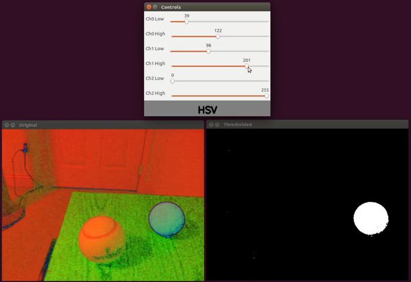
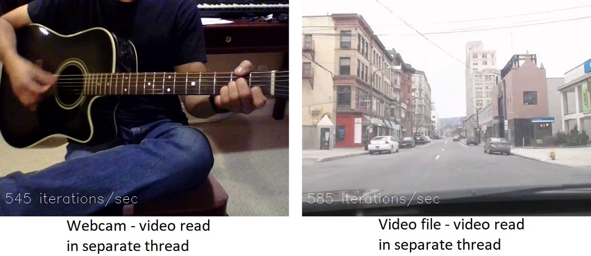
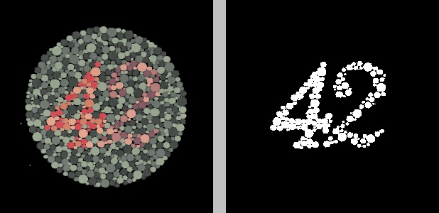
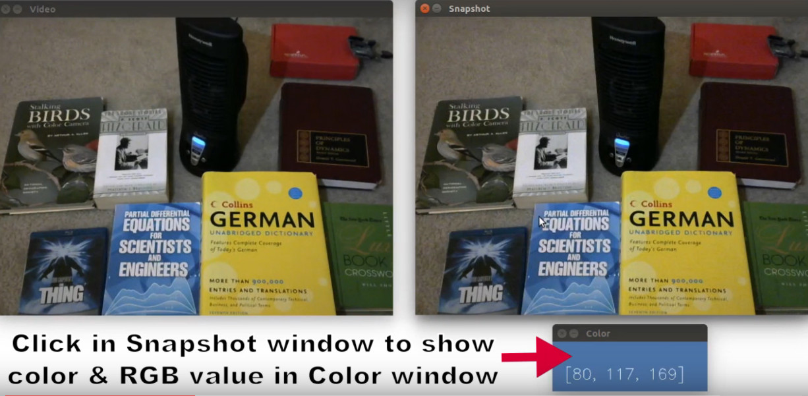
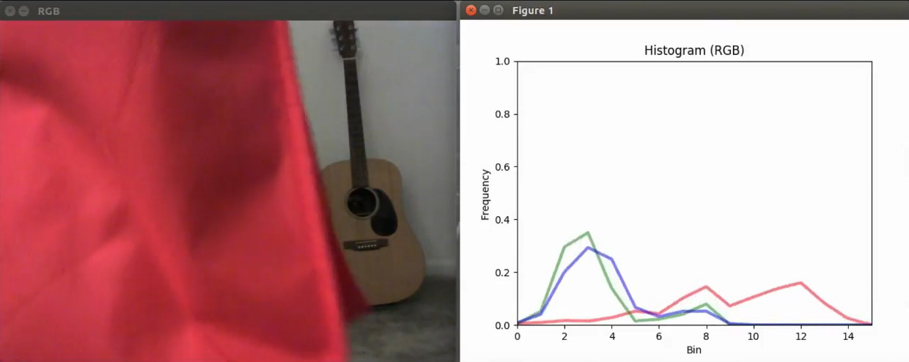
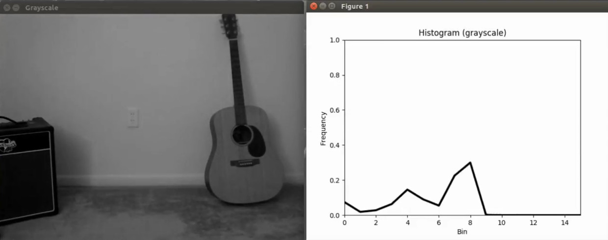

# Computer vision utilities

This repo contains a number of computer vision–related utilities I've made. They rely primarily on OpenCV and are written in C++ and/or Python. Brief descriptions of the following utilities and programs, as well as links to more detailed information, can be found in the sections below.

* [Multi-channel color thresholding](#multi-channel-color-thresholding)
* [Multithreaded video stream read/display](#multithreaded-video-stream-readdisplay)
* [K-means color segmentation](#k-means-color-segmentation)
* [Video pixel RGB values](#video-pixel-rgb-values)
* [Real time color histogram](#real-time-color-histogram)

## Multi-channel color thresholding
C++: [colorthresh.cpp](https://github.com/nrsyed/computer-vision/blob/master/ColorThreshUtil/colorthresh.cpp)

Python: [colorthresh.py](https://github.com/nrsyed/computer-vision/blob/master/ColorThreshUtil/colorthresh.py)

Use this simple OpenCV tool to determine the range of color channel values needed to isolate objects of a certain color. Can be used in real time with a camera, video file, or image file. See the [README](ColorThreshUtil/README.md) for the utility for more information, or [watch a demo of the utility in action on YouTube](https://youtu.be/YGzXznbvyNU).

## Multithreaded video stream read/display
Python: [thread_demo.py](https://github.com/nrsyed/computer-vision/blob/master/multithread/thread_demo.py), [VideoGet.py](https://github.com/nrsyed/computer-vision/blob/master/multithread/VideoGet.py), [VideoShow.py](https://github.com/nrsyed/computer-vision/blob/master/multithread/VideoShow.py), [CountsPerSec.py](https://github.com/nrsyed/computer-vision/blob/master/multithread/CountsPerSec.py)

This directory contains a class to read frames from an OpenCV VideoCapture object in a separate thread (VideoGet), a class to show frames via cv2.imshow() in a separate thread (VideoShow), a class to compute the frequency of an event, like iterations of a while loop per second (CountsPerSec), and a script that implements these to quantify the performance improvement of using separate threads for getting and/or showing video frames (thread_demo.py). See [this blog post](https://nrsyed.com/2018/07/05/multithreading-with-opencv-python-to-improve-video-processing-performance/) for more information and the results.

An example of the output from thread_demo.py can be seen below, where the performance, measured in terms of main thread while loop iterations per second, of both a webcam video stream (left) and a video file (right) is displayed in the lower left corner of each video for the case where VideoCapture.read() is called in a separate thread via the VideoGet class.

*Performance of webcam and video file when video frames are read in a thread separate from the main thread.*

## K-means color segmentation
Python: [color_segmentation.py](https://github.com/nrsyed/computer-vision/blob/master/kmeans_color_segmentation/color_segmentation.py)

This script takes a source image, converts it to the specified color space, and performs K-means clustering on the specified color channels. The number of clusters can, of course, be specified as well. The original image is displayed alongside the "clustered" image. For more information, see [this blog post](https://nrsyed.com/2018/03/29/image-segmentation-via-k-means-clustering-with-opencv-python/). In the clustered image, each cluster is represented by a grayscale hue from white to black, with the cluster containing the fewest pixels represented by the color white, the cluster containing the most pixels represented by black, and (if there are more than two clusters) the intermediate clusters represented by shades of gray.

An example is shown below with an Ishihara color blindness test (left) and its K-means clustered counterpart (right). Before K-means clustering, the original image was converted to the YCrCb color space. K-means clustering was performed on the Cr channel, and the image was split into two clusters, i.e., K=2.

*K-means clustering to isolate the number in a color blindness test.*

## Video pixel RGB values

C++: [get_video_pixel.cpp](https://github.com/nrsyed/computer-vision/blob/master/get_video_pixel/get_video_pixel.cpp)

Python: [get_video_pixel.py](https://github.com/nrsyed/computer-vision/blob/master/get_video_pixel/get_video_pixel.py)

This utility allows you to take a snapshot of a webcam video feed, then left-click anywhere within the "snapshot window." The color and the 8-bit RGB values of the pixel on which you clicked are then displayed in a small "color window." Use the utility to obtain the RGB representation of anything. Both C++ and Python versions of the program are available. For usage and detailed information, see [this blog post](https://nrsyed.com/2018/02/12/get-pixel-rgb-value-from-webcam-video-in-opencv-c-and-python/) and [this YouTube video](https://www.youtube.com/watch?v=EvBfcM2Y-Kk) demonstrating how to use the program.

*Screencap from YouTube video of the program.*

## Real time color histogram

Python: [real_time_histogram.py](real_time_histogram/real_time_histogram.py)

This Python utility displays 3-channel RGB or Lab color histograms or a 1-channel grayscale histogram of a video stream, using a matplotlib plot. The video stream can come from either a camera or a video file. For more detailed information and a demonstration, see [this blog post](https://nrsyed.com/2018/02/08/real-time-video-histograms-with-opencv-and-python/) and a [video of the script output on YouTube](https://www.youtube.com/watch?v=iv60xgjGOvg).

*RGB histograms.*

*Grayscale histogram.*
